# 🌐 Cybersecurity Ecosystem 2025: Emerging Solutions for Threat Detection and Defense

In today’s hyperconnected world, **cybersecurity is no longer optional — it’s a business-critical necessity.** As organizations embrace cloud computing, AI, IoT, and remote work models, the attack surface has grown dramatically. With cybercriminals leveraging automation, artificial intelligence, and sophisticated tactics, companies must adapt by implementing a robust **cybersecurity ecosystem.**

This article explores the **emerging cybersecurity solutions in 2025**, designed to detect threats faster, respond effectively, and defend critical infrastructure from modern cyberattacks.

## 🌐 What is the Cybersecurity Ecosystem?

A **cybersecurity ecosystem** is an integrated framework of technologies, policies, and practices that work together to protect digital assets. Rather than relying on one solution (like antivirus or a firewall), organizations use a **layered approach** to cover:

- Network security  
- Application security  
- Cloud security  
- Endpoint protection  
- Identity and access management  
- Threat detection and response  

The ecosystem ensures **end-to-end protection**, reducing blind spots and strengthening resilience.


## 🔐 Why the Cybersecurity Ecosystem Matters in 2025

- 🚀 **AI-driven threats are on the rise** → Cybercriminals now use AI for phishing, malware creation, and bypassing defenses.  
- 🌍 **Cloud adoption & remote work continue to expand** → Increasing attack surface and data exposure.  
- ⚡ **Ransomware & zero-day attacks are more frequent** → Demanding faster detection and automated defense.  
- 🏛️ **Compliance regulations are stricter** → GDPR, HIPAA, and local data privacy laws require stronger safeguards.  

Organizations that invest in ecosystem-driven cybersecurity will be better positioned to stay ahead of threats.

## 🛡️ Key Components of the Cybersecurity Ecosystem in 2025

Below are the **emerging cybersecurity solutions reshaping digital defense.**


### 1. 🔥 Next-Generation Firewalls (NGFWs)

NGFWs go beyond traditional firewalls by integrating **intrusion prevention, deep packet inspection, and application awareness.** In 2025, they are **AI-powered**, enabling real-time anomaly detection.

**Key Benefits:**
- Blocks malware, ransomware, and DDoS attacks  
- Provides application-level visibility  
- Enforces granular access control  

**Popular Solutions:** Palo Alto Networks, Fortinet, Cisco Firepower  

### 2. 🤖 AI-Powered Threat Detection

Cybercriminals use AI to launch attacks — defenders now counter with **AI-based threat detection.** These systems use **machine learning algorithms** to detect anomalies, zero-day exploits, and insider threats.

**Key Benefits:**
- Detects threats in real time  
- Reduces false positives  
- Learns and adapts to new attack vectors  

**Popular Tools:** Darktrace, Vectra AI, CrowdStrike Falcon  

### 3. ☁️ Cloud Security Platforms

With **multi-cloud and hybrid cloud** setups dominating IT infrastructure, **cloud security solutions** safeguard data, workloads, and applications.

**Key Features:**
- Cloud workload protection (CWP)  
- Cloud security posture management (CSPM)  
- Identity and access governance  

**Popular Tools:** Prisma Cloud, Check Point CloudGuard, Microsoft Defender for Cloud  


### 4. 🔑 Zero Trust Security

The **Zero Trust model** assumes no user or device should be trusted by default. It enforces **continuous verification** of identity, access, and behavior.

**Key Benefits:**
- Reduces insider threats  
- Protects against lateral movement  
- Enhances compliance and data protection  

**Popular Tools:** Okta, Zscaler, Cisco Duo  

### 5. 🖥️ Endpoint Detection & Response (EDR/XDR)

Endpoints (laptops, servers, mobile devices) remain **prime attack targets.** EDR and XDR solutions provide **continuous monitoring, behavioral analytics, and automated response.**

**Key Benefits:**
- Detects malware, ransomware, and insider threats  
- Provides forensic analysis  
- Automates incident response  

**Popular Tools:** SentinelOne, Microsoft Defender XDR, CrowdStrike  

### 6. 📊 Security Information and Event Management (SIEM)

SIEM systems act as the **central nervous system** of the cybersecurity ecosystem. They **aggregate logs, detect suspicious patterns, and provide actionable insights.**

**Key Benefits:**
- Unified visibility of IT infrastructure  
- Real-time alerts & threat intelligence  
- Compliance-friendly reporting  

**Popular Tools:** Splunk, IBM QRadar, Wazuh, Elastic Security  


### 7. 🧑‍💻 Managed Detection & Response (MDR)

Many organizations lack in-house security expertise. **MDR providers** deliver **24/7 monitoring, threat hunting, and response services** to close the skill gap.

**Key Benefits:**
- Access to expert SOC analysts  
- Faster detection & containment  
- Cost-effective alternative to building in-house SOCs  

**Popular Providers:** Rapid7, Arctic Wolf, Sophos MDR  


### 8. 🔒 Identity and Access Management (IAM)

IAM ensures that the **right people access the right resources at the right time.** Advanced IAM solutions integrate **biometrics, MFA, and adaptive authentication.**

**Key Benefits:**
- Prevents credential theft  
- Enforces least privilege access  
- Secures remote workforces  

**Popular Tools:** Okta, Ping Identity, Azure AD  

### 9. 🛠️ Security Orchestration, Automation & Response (SOAR)

SOAR platforms **automate repetitive tasks**, such as **incident triage, malware analysis, and response actions.**

**Key Benefits:**
- Reduces analyst workload  
- Speeds up response time  
- Integrates with SIEM, EDR, and threat intel tools  

**Popular Tools:** Palo Alto Cortex XSOAR, Splunk SOAR, IBM Resilient  

### 10. 🌍 Cyber Threat Intelligence (CTI)

CTI provides organizations with **real-time insights into emerging threats, attacker tactics, and vulnerabilities.**

**Key Benefits:**
- Enables proactive defense  
- Improves incident response  
- Helps prioritize vulnerabilities  

**Popular Tools:** Recorded Future, Mandiant, ThreatConnect  


## 📈 The Future of Cybersecurity Ecosystem

By 2025, cybersecurity will be more **AI-driven, automated, and cloud-native.** Organizations will increasingly adopt:

- **AI-powered SOCs** → Fully automated detection and response  
- **Quantum-safe cryptography** → Protection against quantum computing threats  
- **Cybersecurity mesh architectures** → Interconnected, modular defense systems  
- **Proactive cyber resilience** → Focusing on recovery as much as prevention  


## ✅ Final Thoughts

The cybersecurity ecosystem in 2025 is not about using a single tool, but about building an **integrated defense system.** From firewalls to AI-driven detection, zero trust models, cloud security, and SOAR automation, these solutions form a **multi-layered shield** against evolving threats.  

Businesses that invest today in these emerging solutions will not just survive — they will **thrive securely in the digital future.**


Awesome — here’s a **summarized, cleaner, and more visual** Mermaid diagram you can drop straight into a **GitHub `.md`** file. It groups your tools by function and shows a simple **Detect → Analyze → Respond** flow.

````markdown
# 🛡️ Emerging Solutions for Threat Detection & Defense (Summarized)

```mermaid
flowchart TD
    %% --------- Core Flow ---------
    A[👁️ Detect] --> B[🔎 Analyze] --> C[🚨 Respond]

    %% --------- Groups / Categories ---------
    subgraph G1[🌐 Network & Visibility]
      N1["Nmap<br/>Wireshark<br/>Snort<br/>SolarWinds"]
    end

    subgraph G2[🧪 App & Code Security]
      A1["Burp Suite<br/>OWASP ZAP<br/>Veracode<br/>Checkmarx"]
    end

    subgraph G3[☁️ Cloud Security]
      C1["Prisma Cloud<br/>AWS GuardDuty<br/>Microsoft Defender for Cloud<br/>Cloudflare"]
    end

    subgraph G4[📊 SIEM & Threat Monitoring]
      S1["Splunk<br/>IBM QRadar<br/>Wazuh"]
    end

    subgraph G5[🧭 Incident Response & On-Call]
      R1["PagerDuty"]
    end

    %% --------- Data Flow Mapping ---------
    N1 --> A
    A1 --> A
    C1 --> A

    A --> S1
    S1 --> B

    B --> R1
    R1 --> C

    %% --------- Visual Emphasis ---------
    classDef group fill:#f5f7ff,stroke:#7a8cff,stroke-width:1px,rx:10,ry:10,color:#111,font-weight:bold;
    classDef step fill:#eef9f2,stroke:#2f855a,stroke-width:1.5px,rx:12,ry:12,font-weight:bold;
    class G1,G2,G3,G4,G5 group;
    class A,B,C step;
````

```



### Notes
- **Summarized**: tools are clustered into five clear blocks to keep the diagram compact.
- **Flow**: telemetry from Network/App/Cloud feeds **Detect**, then centralized in **SIEM** for **Analyze**, and finally **Respond** via **PagerDuty**.
- Works natively on **GitHub** (Mermaid enabled). If your repo doesn’t render Mermaid, enable it in repo settings or view on GitHub web UI.

Want a **logo-rich version** (badges per tool) below the diagram for extra visual flair on your README?
```
